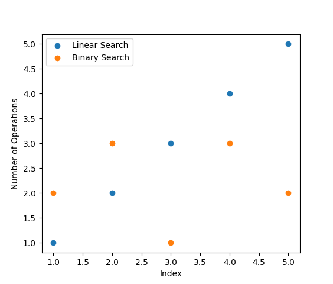
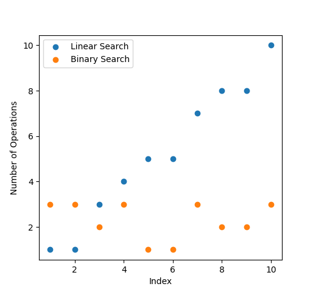
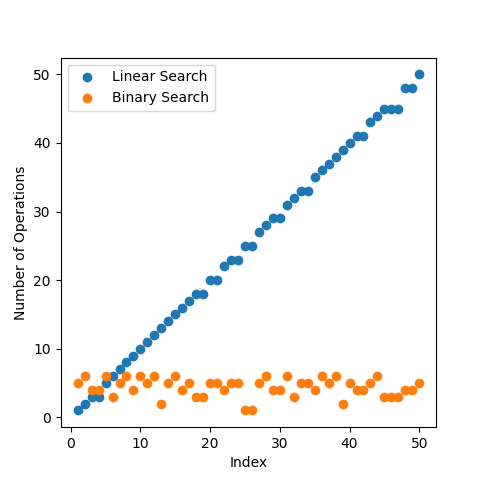
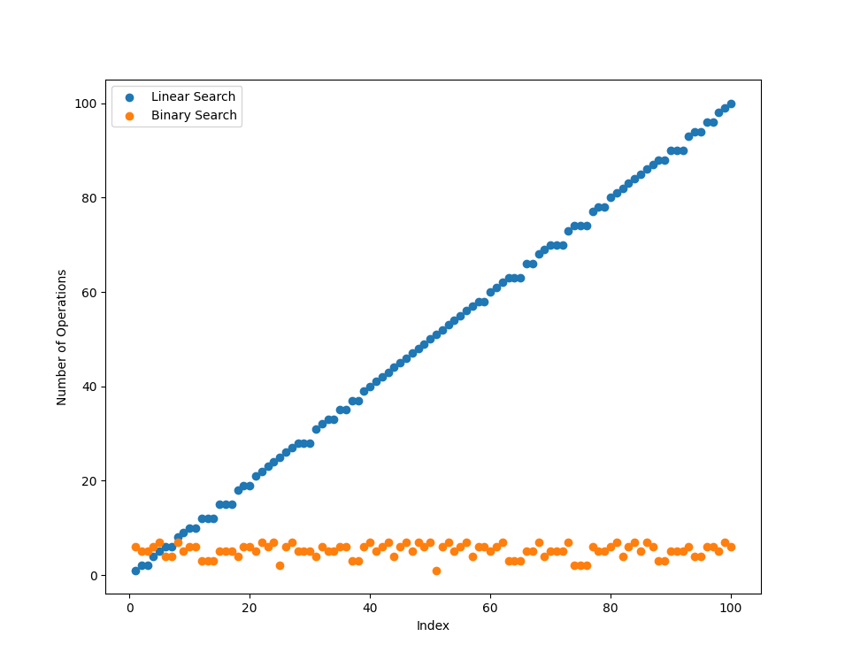

# Binary Search vs. Linear Search

## General Differences
|                     |  Linear Search  |  Binary Search  |
| ------------------- | :-------------: | :-------------: |
|**Time Complexity**  |                 |                 |
| Best                |      $O(1)$     |      $O(1)$     |
| Average             |      $O(n)$     |   $O(log(n))$   |
| Worst               |      $O(n)$     |   $O(log(n))$   |
|**Space Complexity** |                 |                 |
| Best, Average, Worse|      $O(1)$     |      $O(1)$     |

## But How Much It?

- I wrote a Python [script](lin_vs_bin.py) to visualize how many iterations/function calls does the Linear Search and the Binary Search takes to find out ANY value from the array/dataset.

- with 5 elements:\
\
well, doesn't seem much of a difference. (pure luck, or not?)

- let's try with 10 elements:\
\
Hmm, luck has started to vanish!
and if we keep moving forward

- with 50 elements:\

- and with 100 elements:\

- What it basically says, is the amount of steps (iterations/function calls) the algorithm has to take grows linearly (in Linear Search) and Logarithmically (in Binary Search), which is just huge of the difference,depicted in the scatter plots above.
