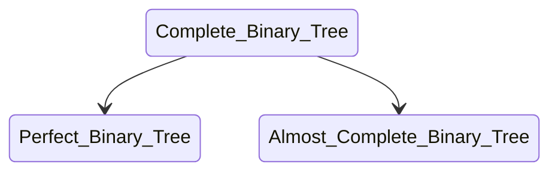
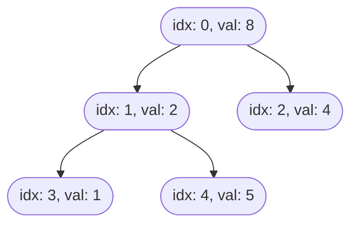
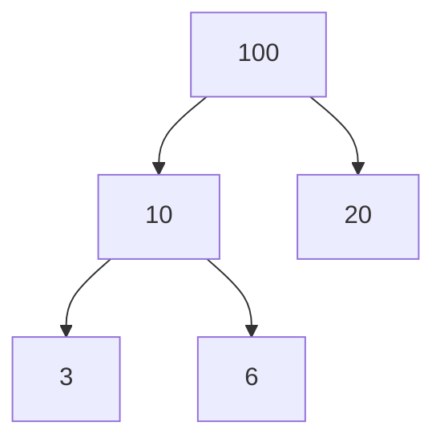
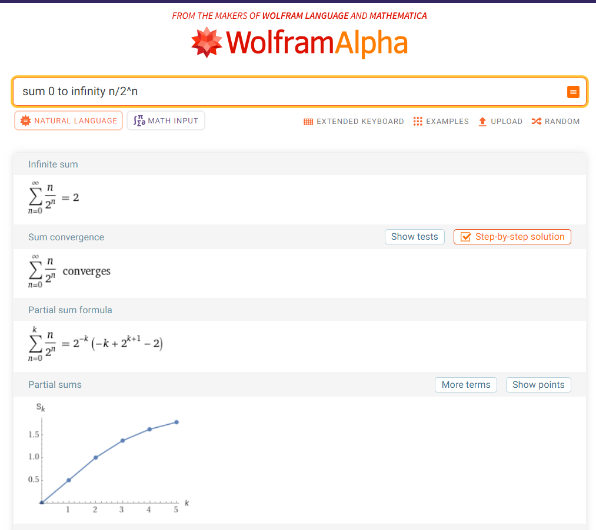

# Heap Data Structure
> _source(s): [GeeksForGeeks](https://www.geeksforgeeks.org/heap-data-structure/), [Wikipedia](https://en.wikipedia.org/wiki/Heap_(data_structure)), [YT/Techdose/Heap full course](https://www.youtube.com/playlist?list=PLEJXowNB4kPyP2PdMhOUlTY6GrRIITx28)_

- A Heap is a tree-based data structure that satisfies the **heap property**:
    - In a _max heap_, for any given node $C$ _(child)_, if $P$ is a parent node of $C$, then the key of $P$ is greater than or equal to the key of $C$.
    - In a _min heap_, the key of $P$ is less than or equal to the key of $C$.
- The node at the "`top`" of the heap (with no parents) is called the _root_ node.

## Operations of Heap Data Structure
- **Heapify**
    - The process in which the array or the binary tree is reshaped into a Heap data structure.
- **Insertion**
    - The process of inserting an element in existing heap.
    - time complexity: $O(log(n))$
- **Deletion**
    - The process of deleting the "top" element of the heap and returning the element
    - time complexity: $O(log(n))$
- **Peek**
    - to check or find the first (or the "`top`") element of the heap.
    - time complexity: $O(1)$

---

## Why use Heap Data Structure?
- A heap is a useful data strucure when it is necessary to repeatedly remove the object with the highest (or lowest) priority, or when insertions need to be interspersed with removals of the root node.

- Additionally, Heaps are used in many famous algorithms such as Dijkstra's algorithm for finding the shortest path, the heap sort sorting algorithm, implementing priority queues, and more. Essentially, heaps are the data structure you want to use when you want to be able to access the maximum or minimum element very quickly.

### Power of Heap
- While working with an unsorted array (say, `[2, 4, 1, 6, 9, <empty>]`)
    - `insert(10)`
        - $T(n) = O(1)$
        - Array allows random access, We just need to know the last empty index.
    - `search(6)`
        - $T(n) = O(n)$
        - Have to traverse through the array of length `n`.
    - `findMin()`
        - $T(n) = O(n)$
        - Have to traverse through the array of length `n`.
    - `deleteMin()`
        - $T(n) = O(n)$
        - Find min ($O(n)$), then delete it.
- with sorted array (say, `[1, 2, 4, 6, 9, <empty>]`)
    - `insert(7)`
        - $T(n) = O(n)$
        - Insertion algorithm, move elements.
    
    - `search(6)`
        - $T(n) = O(log(n))$
        - Binary Search

    - `findMin()`
        - $T(n) = O(1)$
        - First (or last) element would be minimum.

    - `deleteMin()`
        - $T(n) = $O(n)$ if array is sorted ASC else $O(1)$
        - Can't leave void at the start point.
- with LinkedList (say, `2 -> 4 -> 1 -> 6 -> 9 -> None`)
    - `insert`
        - `insert_at_beginning(<value>)`:
            - $T(n) = O(1)$
            - Links updation at the beginning.
        - `insert_at_end(<value>)`:
            - without tail:
                - $T(n) = O(n)$
                - have to traverse through the whole linked list the find the end
            - with tail:
                - $T(n) = O(1)$
                - links updatation at the end.
        - `insert_after(<reference>, <value>)`
            - $T(n) = O(n)$
            - have to traverse through whole linked list
    - `delete`
        - same complexities as insertion for respective places.
    - `find_min()`
        - $T(n) = O(n)$
        - have to travere through whole linked list

- Working with Heaps:
    - `insert(<value>)`
        - $T(n) = O(log(n))$
        - Heapify (To satisfy heap properties)
    - `find_min()`: (for a min heap)
        - $T(n) = O(1)$
        - in a **Min Heap**, the minimum element sits on the very first index, always.
    - `find_max()`: (for a max heap)
        - $T(n) = O(1)$
        - in a **Max Heap**, the maximum element sits on the very first index, always.
    - `heapify()`:
        - $T(n) = O(log(n))$

#### The Overall Comparisons:

| Data Structure | `insert`    | `search`    | `find_min` | `delete`    |
| -------------- | :---------: | :---------: | :--------: | :---------: |
| Unsorted Array | $O(1)$      | $O(n)$      | $O(n)$     | $O(n)$      |
| Sorted Array   | $O(n)$      | $O(log(n))$ | $O(1)$     | $O(n)$      |
| Linked List    | $O(1)$      | $O(n)$      | $O(n)$     | $O(n)$      |
| Min Heap       | $O(log(n))$ | $O(n)$      | $O(1)$     | $O(log(n))$ |

---

### Introduction to Heaps:

- Heap follows Complete Binary Tree structure:



- **Perfect Binary Tree**
    - All the levels are completely filled, eg.:
        ```mermaid
        graph TD
        1((1))
        2((2))
        3((3))
        4((4))
        5((5))
        6((6))
        7((7))

        1 --> 2
        1 --> 3

        2 --> 4
        2 --> 5

        3 --> 6
        3 --> 7
        ```
- **Almost Complete Binary Tree**
    - Only the last level or the 2nd last level may contain leaves.
    - Must be filled from left-to-right.
    - All the levels are not completely filled.
        ```mermaid
        graph TD
        1((1))
        2((2))
        3((3))
        4((4))
        5((5))
        6((6))

        1 --> 2
        1 --> 3

        2 --> 4
        2 --> 5

        3 --> 6
        ```

### Heap
- Tree-based data structure
- Complete Binary Tree
- Follows Heap Property
- Types:
    - Min Heap
    - Max Heap

---

### The Implementation
- In order to implement a Heap, you need to know basic tree concepts:

#### Tree Concepts
- While representing tree in the form of an array: (e.g., [8, 2, 4, 1, 5])
let index `i` be the parent,\
$\text{parent} = i$, then\
$\text{left child} = 2i + 1$\
$\text{right child} = 2i + 2$



- and, if let's say `i` is a child's index, then its parent's index would be $\lceil{\frac{i}{2}}\rceil - 1$

#### Hight of the Tree
- height of the tree = the lowest level of the tree
- If Height is `h`, then
    - Max Nodes only at level `h`: $ 2^h $, and
    - Max Nodes in the entire tree: $ 2^{h+1} - 1 $
- In case of a Perfect Binary Tree
    - No. of internal nodes = No. of leaves - 1

| Height                |  0  |  1  |  2  |  3  | ... |
| :-------------------: | :-: | :-: | :-: | :-: | :-: |
| Max Nodes at Height   |  1  |  2  |  4  |  8  | ... |
| Max Nodes in the tree |  1  |  3  |  7  | 15  | ... |

- In case of Binary Tree
    - Height of Tree = $\lfloor \log_{2}(n) \rfloor$, where n = number of nodes.
    > base of the log = maximum number of children each parent can have (here 2, because it is a binary tree)

| Nodes  |  1  |  2  |  3  |  4  |  5  | ... |
| :----: | :-: | :-: | :-: | :-: | :-: | :-: |
| Height |  0  |  1  |  1  |  2  |  2  | ... |

- In a Complete Binary Tree
    - Indexes of leaves = $\lfloor \frac{n}{2} \rfloor$ to $n - 1$
    - $\therefore$ indexes of internal nodes = 0 to $\lfloor \frac{n}{2} \rfloor - 1$

___

#### Max Heap
- A Complete Binary Tree
- Can be stored in an Array
e.g.:


- Heap's array representation: 
    - values: `[100,  10,  20,   3,   6]`
    
- BUT, How long should the array be?
    - In the worst case, all the levels of a tree will be completely filled.
        - $\therefore$ It will be a perfect binary tree.
        - if height(PBT) = `h`
        - then, No. of nodes = $ 2^{h+1} - 1 $ $\leftarrow \text{(size of array)} $

**Max Heapify (aka Percolate Down) Algorithm**
- Max Heap: Root node should be greater than all left and right sub-tree nodes and it is recursively true for all sub-trees.
- A Leaf node always follows the min/max heap property.
    - $\because$ we only have 1 node.
> Important: We can heapify index `i` only if all elements in both left and right sub-trees are following heap property.
- Assume that the array is in a Max Heap form except for i-th index,
- Rearranging the i-th indexed node to maintain heap property.
    - after rearranging i-th index, recursively rearrange its children (until we reach to leaf or current element is greater than its children.)

> The process of rearranging the heap by comparing each parent with its children **recursively** is known as heapify.

- **Algorithm**:

    ```c
    MaxHeapify(array, index){
        leftChild = 2 * i + 1;
        rightChild = 2 * i + 2;

        largest = index;

        if (leftChild < array.heapSize && array[leftChild] > array[largest]){
            largest = leftChild;
        }
        if (rightChild < array.heapSize && array[rightChild] > array[largest]){
            largest = rightChild;
        }

        if(largest != index){
            swap(array[index], array[largest]);
            MaxHeapify(array, largest);
        }
    }
    ```
- **Time Complexity**: $O(\log(n))$

**Build Heap Algorithm**:
- Internal nodes: $\lfloor \frac{n}{2} \rfloor - 1$ where $n$ = number of nodes.
- Start from last internal node to 0th node, and max heapify them all. (Bottom-Up approach)
- **Algorithm**:
    ```c
    BuildMaxHeap(array){
        for(i = floor(array.heapSize/2) - 1 to 0){
            MaxHeapify(array, i);
        }
    }
    ```
- **Time Complexity**
    - To heapify one node, we take $O(log(n))$ time, we do this for $n$ times, so, intuitively, $T(n) = O(n\log(n))$, but that is not the case. ❌
    - The actual time complexity, $T(n) = O(n)$ ✅

    - **The Proof**
        - In a perfect binary tree, at any level `h` = $\lceil \frac{n}{2^{h + 1}} \rceil$
        - for almost complete binary tree, it would be less than that. (since, it will have atleast one node less than a perfect binary tree)

        - The time complexity to max-heapify a node at height, $h = O(h)$ (where, $h = \log(n)$)
        - $\therefore$ total time at level h = $\lceil \frac{n}{2^{h + 1}} \rceil \cdot O(h)$

        - more the height of a node, more expected runtime.
        - $\therefore$ total time ($h:0 \rightarrow \log(n)$) \
            = $ \Sigma_{h = 0}^{\log(n)} \lceil \frac{n}{2^{h+1}} \rceil \cdot O(h)$

            = $ C_1 \cdot n \Sigma_{h = 0}^{\log(n)} \lceil \frac{1}{2^h \cdot 2} \rceil \cdot C_2 \cdot h $

            = $ C \cdot n \Sigma_{h = 0}^{\log(n)} (\frac{h}{2^h}) $ <<< $ C \cdot n \Sigma_{h = 0}^{\infty} (\frac{h}{2^h}) $

        

        - So, $ \Sigma_{h = 0}^{\infty} \frac{h}{2^h} = 2 $
        
        - $\therefore$ Total time = $ O(\frac{C\cdot n}{2} \cdot 2) = O(n) $

**Insert**
1. set the last element as to-be-added element.
2. while `index > 0` and `heap[parentOf(index)] < heap[index]`
    - `index = parentOf(index)`
- Algorithm
    ```c
    insert(maxHeap, value) {
        if (maxHeap->heapSize == maxHeap->maxSize) {
            printf("Error: Heap is full.\n");
            return;
        }

        int index = maxHeap->heapSize;
        maxHeap->data[index] = value;
        maxHeap->heapSize++;

        while (index > 0 && maxHeap->data[parent(index)] < maxHeap->data[index]) {
            swap(maxHeap->data, index, parent(index));
            index = parent(index);
        }
    }
    ```


**Extract Max**
1. Save max value
2. Copy last to root
3. Remove last, and decrease heap size
4. Heapify root

- **Algorithm**
    ```c
    ExtractMax(array){
        if(array.heapSize < 1)
            throw HeapUnderFlow;
        max = array[0];
        array[0] = array[array.heapSize--];
        MaxHeapify(array, 0);
        return max;
    }
    ```

---
#### Min Heap
- Root value should be the smallest, and all the sub-trees should be Min Heaps.
- **Min Heapify**: Change all the greater thans (`>`) to less than (`<`) and vice-versa.

---

### Fun Fact:
- An array sorted in ascending order will already be in form a min heap, conversely, an array sorted in descending order will always form a max heap.

___

### The applications
1. Priority Queues
    - Scheduling Tasks
    - Handling Interruptions
    - Processing Events
2. Sorting Algorithms
    - [Heapsort](<../../../Algorithms/Sorting/Heap Sort>), $T(n) = O(nlog(n))$
3. Graph Algorithms
    - Dijkstra's Shortest Path Algorithm
    - Prim's Minimum Spanning Tree Algorithm
    - A* Search Algorithm
4. File Compression
    - Huffman Coding (Min Heap)
5. Dynamic Programming
    - Greedy Algorithms

